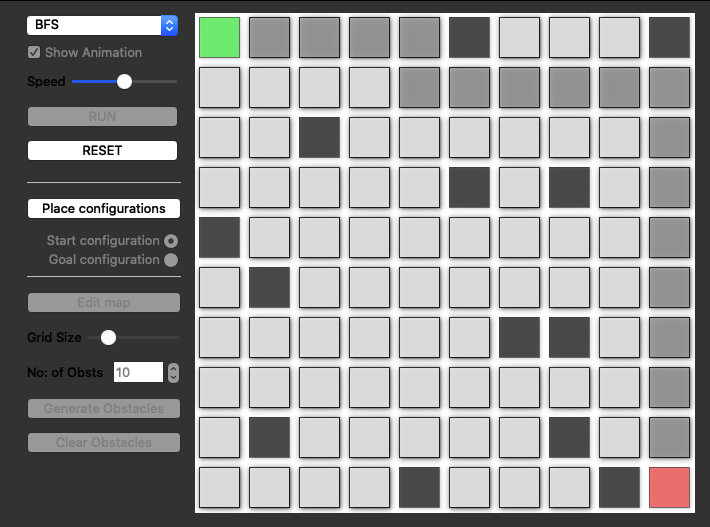

# Pathfinding Visualizer

## Overview

A GUI for visualizing numerous pathfinding algorithms.

The project is based on C++11 and Qt. This is currently an ongoing project and more features and different planning algorithms will be added in the near future.

## Dependencies

* cmake >= 2.8
  * All OSes: [click here for installation instructions](https://cmake.org/install/)
* make >= 4.1 (Linux, Mac), 3.81 (Windows)
  * Linux: make is installed by default on most Linux distros
  * Mac: [install Xcode command line tools to get make](https://developer.apple.com/xcode/features/)
  * Windows: [Click here for installation instructions](http://gnuwin32.sourceforge.net/packages/make.htm)
* Qt 5
  * All OSes: [click here for installation instructions](https://www.qt.io/download-open-source)
* gcc/g++ >= 5.4
  * Linux: gcc / g++ is installed by default on most Linux distros
  * Mac: same deal as make - [install Xcode command line tools](https://developer.apple.com/xcode/features/)
  * Windows: recommend using [MinGW](http://www.mingw.org/)

## Basic Build Instructions

1. Clone this repo.
2. Make a build directory in the top level project directory: `mkdir build && cd build`
3. Compile: `cmake .. && make`
4. Run it: `./pathfinding_visualizer_qt`.

## TODO

### Search-based planners
- [x] BFS
- [ ] DFS
- [ ] DIJKSTRA
- [ ] A*
- [ ] Bidirectional-A*
- [ ] LPA*
- [ ] D*
- [ ] D* lite

### Sampling-based planners
- [ ] RRT
- [ ] RRT-Connect
- [ ] RRT*
- [ ] Informed-RRT*
- [ ] FMT*
- [ ] BIT*
- [ ] ABIT*
- [ ] AIT*
